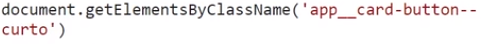
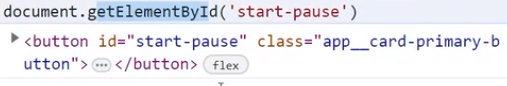

# O que é um Evento no DOM?

- Pense nisso como sinais que o navegador envia quando algo acontece - como um usuário que clica em um botão em sua página web, por exemplo. Quando um evento ocorre, você tem a capacidade de reagir a ele e executar algumas ações, como exibir uma mensagem para o usuário, alterar ou adicionar algum elemento na página.

O Método addEventListener
Antes de mergulharmos nos diferentes tipos de eventos, vamos entender rapidamente como o método addEventListener funciona. Ele é um método disponível para todos os elementos HTML e permite que registremos funções (callbacks) que serão chamadas quando um evento específico ocorrer.

A sintaxe básica é a seguinte:

elemento.addEventListener(evento, callback);

O Método addEventListener
Antes de mergulharmos nos diferentes tipos de eventos, vamos entender rapidamente como o método addEventListener funciona. Ele é um método disponível para todos os elementos HTML e permite que registremos funções (callbacks) que serão chamadas quando um evento específico ocorrer.

A sintaxe básica é a seguinte:

elemento.addEventListener(evento, callback);

// HTML <button id="meuBotao">Clique aqui</button>

const meuBotao = document.getElementById("meuBotao");
meuBotao.addEventListener("click", function() {
  alert("O botão foi clicado!");
});

# commands

### docoment (return tag of html)
- document.select('nomedatag ou class') (return the element)

GET CLASS

 
GET ID 

#### método innerHTML

O método innerHTML é usado para alterar o conteúdo HTML de um elemento. No caso do projeto Fokus, ele é utilizado para alterar o texto exibido na tag <h1>. Dependendo do contexto selecionado (foco, descanso-curto ou descanso-longo), o texto é modificado de acordo com as instruções do instrutor. Além disso, o método também pode ser usado para inserir texto formatado, como a adição das tags <strong> para destacar partes do texto.

- No projeto Fokus, o método innerHTML também é utilizado para criar listas. Para isso, basta adicionar o sinal de + antes do = para concatenar strings e inserir os elementos da lista. Por exemplo:
             
  case "foco":
    titulo.innerHTML = `
    Otimize sua produtividade, 
    <strong class="app__title-strong">mergulhe no que importa.</strong>
    `
break;
   
- Nesse caso, o texto "Otimize sua produtividade, mergulhe no que importa" é inserido na tag <h1>, formando uma lista. É importante lembrar de utilizar a sintaxe correta para criar as tags HTML dentro da string do innerHTML.
