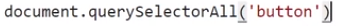

# O que é um Evento no DOM?

- Pense nisso como sinais que o navegador envia quando algo acontece - como um usuário que clica em um botão em sua página web, por exemplo. Quando um evento ocorre, você tem a capacidade de reagir a ele e executar algumas ações, como exibir uma mensagem para o usuário, alterar ou adicionar algum elemento na página.

O Método addEventListener
Antes de mergulharmos nos diferentes tipos de eventos, vamos entender rapidamente como o método addEventListener funciona. Ele é um método disponível para todos os elementos HTML e permite que registremos funções (callbacks) que serão chamadas quando um evento específico ocorrer.

A sintaxe básica é a seguinte:

elemento.addEventListener(evento, callback);

O Método addEventListener
Antes de mergulharmos nos diferentes tipos de eventos, vamos entender rapidamente como o método addEventListener funciona. Ele é um método disponível para todos os elementos HTML e permite que registremos funções (callbacks) que serão chamadas quando um evento específico ocorrer.

A sintaxe básica é a seguinte:

elemento.addEventListener(evento, callback);

// HTML <button id="meuBotao">Clique aqui</button>

const meuBotao = document.getElementById("meuBotao");
meuBotao.addEventListener("click", function() {
  alert("O botão foi clicado!");
});

# commands

### docoment (return tag of html)
- document.select('nomedatag ou class') (return the element)

GET CLASS

 
GET ID 

